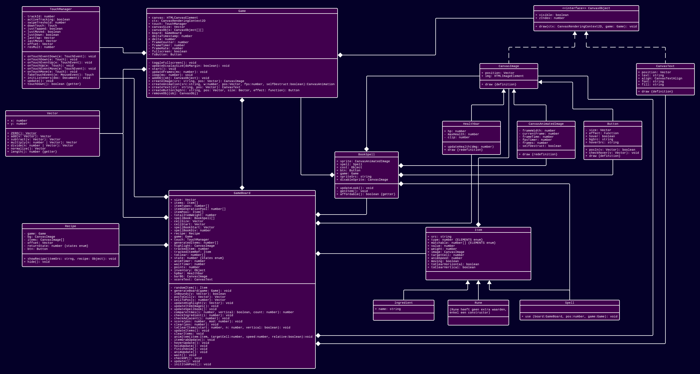

# PRG04 HERKANSING eindopdracht 

Wanneer je volledige eindcijfer (klassendiagram + afgeronde eindopdracht) een onvoldoende is kan je het hele project herkansen. 

- [Kies een nieuwe startopdracht met uniek thema en game mechanic in de gaminator](https://hr-cmgt.github.io/gaminator/) 
- Bedenk hiermee een nieuw game concept. 
- Maak een **nieuw klassendiagram**. 
- **Bouw je nieuwe game** in Object Oriented Typescript.
- Vul dit inleverdocument helemaal in

## Deadline: 23 augustus

**De deadline voor het inleveren van de game is Maandag 23 augustus om 10:00 (week 0).**

⚠️ Je werk wordt **beoordeeld volgens de cursushandleiding**. Lees dit nog even goed door voordat je je project inlevert.

---

<br>
<br>
<Br>

# Klassendiagram


Plaats je klassendiagram als PNG bestand. Dat kan je doen met een image tag:

```javascript

```
## Classes en verantwoordelijkheden

### Game
`Game` regelt een aantal algemene zaken.
`Game` heeft de `loop`-functie, dit is dé functie die alles laat updaten. In de `loop`-functie worden de `draw`-functies van alle `CanvasObjects` aangeroepen, de `TouchManager` wordt ge-update en delta wordt berekend.<br><br>
`Game` heeft een referentie naar alle `CanvasObjects` die op de canvas getekend moeten worden. Op volgorde van `zIndex` (laag naar hoog) worden deze tijdens het loopen allemaal geupdate. Het is een 2D array, op de 10e plek zit een array met alle objecten die een `zIndex` hebben van 10.<br><br>
In `updateDisplaySize` wordt de grootte van het canvas afgesteld op de grootte van het scherm. Deze neemt met `getBoundingClientRect()` de grootte van de pagina, haalt hier (indien niet in fullscreen) de margins van af en berekent vervolgens hoe hoog en breed de canvas kan zijn. Wordt aangeroepen elke keer dat de window wordt ge-resized.<br><br>
`fsButton` is een `Button` die regelt dat je fullscreen in- en uit kan schakelen. Of je in fullscreen zit wordt in `fullscreen` bijgehouden, op die manier kan ik ervoor zorgen dat de margins rondom het canvas verdwijnen wanneer je fullscreen inschakelt.<br><br>
`Game` heeft een aantal `create___`-functies. Deze dienen als een soort wrapper voor het aanmaken van bepaalde classes en haalt de objecten meteen door `addObj()` waardoor de objecten die je aanroept ook meteen gerendered worden. Zo kun je in één keer `createImage(args...)` doen in plaats van 
```ts
let img = new Image(args...);
addObj(img);
```
Je kan elk object weer verwijderen met behulp van `removeObj(obj)`.<br><br>
De `start`-functie start de gehele game en het speelveld op.

### TouchManager
`TouchManager` regelt input van zowel de muis als van een touchscreen, doordat allebei dezelfde output geven hoef ik op andere plekken geen aparte code voor muis en touch te schrijven.<br><br>
`downTouch` slaat de event op die is meegegeven mij een 'mouseDown' of 'touchDown' event. Zo kan ik ophalen op welke positie de klik/tik begonnen is.<br><br>
`just`- `Tapped`, `Moved` en `Down` houden bij of er in de laatste frame een klik/tik is losgelaten, bewogen of neergekomen.<br><br>
`last`- `Tap` en `Move` houden de positie van de laatste tik en beweging bij.<br><br>
`offset` en `resMult` worden gebruikt om de positie in pixels op het originele 160px × 320px canvas te berekenen van een klik/tik. `offset` houdt de linkerbovenhoek van de canvas bij en `resMult` hoe groot de canvas is t.o.v. 160px × 320px.<br><br>
`onTouch`- `Down`, `Up`, `Move` nemen de event-objecten die worden gegenereerd bij interactie via de muis/touchscreen en updaten op basis hiervan de input-data zoals of er afgelopen frame is getikt en waar er voor het laatst is bewogen. De `event`-varianten van deze functies werken als een wrapper voor specifiek het touchscreen, deze vergelijken de id van de events met `trackId` om ervoor te zorgen dat er maar één vinger tegelijk bij wordt gehouden. Indien de id's overeenkomen wordt het event direct doorgevoerd naar de corresponderende methods.<br><br>
`fakeTouchEvent` neem een `MouseEvent` en zet deze om tot een `Touch`-mockup, deze kan ik dan invoeren in de `onTouch`-functies.<br><br>
`initListeners` koppelt de muis- en touchEvents aan de corresponderende methods.<br><br>
`update` reset de `just`-variabelen en moet dus elke frame aangeroepen worden.<br><br>
De `touchDown`-getter geeft aan of op dit moment de muis wordt ingedrukt/er een vinger op het scherm drukt.

### Vector
`Vector` is een class om coordinaten bij te houden en ermee te rekenen. Heeft een `x`- en `y`-waarde (getallen) en kan hier een aantal functies op uitvoeren. <br><br>
Met `add` en `subtract` kun je bij de `Vector` een andere `Vector` optellen/ aftrekken.<br><br>
Met `multiply` en `divide` kun je de `Vector` vermenigvuldigen met/ delen door een andere `Vector` óf een getal! Bij een `Vector` is het `v1.x * v2.x; v1.y * v2.y` en bij een getal wordt op de X en de Y hetzelfde getal toegepast.<br><br>
Let Op! Bij alle functies hierboven wordt het resultaat niet toegepast op de `Vector` waarop je de functie uitvoert maar wordt er een nieuwe `Vector` teruggegeven met het resultaat.<br><br>
`normalize` geeft een `Vector` die dezelfde 'richting' op gaat maar een lengte heeft van 1.<br><br>
Met dank aan Pythagoras heb ik een `length`-getter kunnen implementeren die de lengte van de `Vector` teruggeeft.

### CanvasObject
Een interface die door alle objecten die moeten worden gerendered, b.v. `CanvasImage` en `CanvasText`, wordt geïmplementeerd.<br><br>
`visible` spreekt een beetje voor zich, staat dit op false dan zou het object niet moeten worden getekend.<br><br>
`zIndex` werkt zoals de z-index in b.v. CSS, hogere waarden worden getekent over de lagere waarden heen.<br><br>
`draw` is een algemene method die dus niet wordt gedefiniëerd. De objecten die `CanvasObject` implementeren definiëren deze funtie elk op hun eigen manier om aan te geven hoe het getekend moet worden. Als je de functie op een `CanvasImage` aanroept tekent het een afbeelding en als je het op een `CanvasText` aanroept tekent het wat tekst, het feit dat dit bij alle objecten dezelfde naam en parameters heeft maakt het makkelijk om in `Game` één stuk code te schrijven die alle objecten kan tekenen. Neemt een `Game` en een `CanvasRenderContext2D` als parameters, dit is waar 'game' en 'ctx' naar verwijzen in de toelichting van alle implementaties van dit interface.

### CanvasImage
Implementatie van `CanvasObject`. Tekent de een afbeelding, `img`, op een bepaalde plek op de canvas, `position`.<br><br>
In `draw` wordt `ctx.drawImage` aangeroepen met de `img`- en `position`-attributen als argumenten:
```ts
ctx.drawImage(this.img, this.position.x, this.position.y);
```

### CanvasAnimatedImage
Extensie van `CanvasImage`. Kan een animaties tekenen op basis van een (horizontale) spritesheet.<br><br>
`frameWidth` geeft de breedte aan van individuele frames. Op basis hiervan wordt ook het totaal aantal frames in de afbeeldinge, `frames`, berekend.<br><br>
`frameTime` geeft aan hoevel milliseconden lang elke frame is, soort 'omgekeerde' fps.<br><br>
In `draw` wordt het aantal ms sinds de vorige frame opgeteld bij `fpsTimer`. Indien `frameTime` hierdoor wordt overschreden wordt er één opgeteld bij `currentFrame`. Indien `currentFrame` hoger is dan `frames` wordt er geloopt of wordt het hele object verwijderd van de game, ligt eraan of `selfDestruct` op true of false staat.<br><br>
Als de huidige frame eenmaal bepaald is wordt er berekend welk deel van de afbeelding getekend moet worden. Vervolgens wordt dat deel dus getekend:
```ts
let clipPos = this.currentFrame * this.frameWidth;
if (this.visible) {
    ctx.drawImage(this.img, clipPos, 0, this.frameWidth, this.img.height,
    this.position.x, this.position.y, this.frameWidth, this.img.height);
}
```

### Healthbar
Extensie van `CanvasImage`. Bepaalt op zichzelf welke afbeelding er wordt getekend (healthbarOver.png), en tekent enkel een deel van deze afbeelding.<br><br>
`hp` geeft huidige hp van de vijand aan, `maxHealth` het maximum. `clip` is het percentage dat de vijand van z'n `maxHealth` over heeft vermenigvuldigd met de breedte van de afbeelding.<br><br>
`updateHealth` haalt een getal van `hp` af en herberekent wat `clip` moet zijn.<br><br>\
`draw` tekent de eerste [`clip`] rijen pixels van de afbeelding:
```ts
let h = this.img.height;
ctx.drawImage(this.img, 0, 0, this.clip, h, this.position.x, this.position.y, Math.ceil(this.clip), h);
```

### Button
Extensie van `CanvasImage`. Naast het tekenen van een afbeelding functioneert het ook als knop.<br><br>
`size` wordt in combinatie met `position` van `CanvasImage` gebruik om in `posIn` te bepalen of een `Vector` zich binnen de randen van de knop bevindt. Als je als `Vector` de positie van de muis meegeeft (zoals in `draw` en `checkHover` wordt gedaan), kun je kijken of je met de muis op de knop rust.<br><br>
In `draw` wordt `checkHover` uitgevoerd met de muis-coordinaten als input (uit de game-parameter gehaald). Als hieruit blijkt dat je muis boven de knop zit kan de afbeelding worden verandert van het bestand in `bgSrc` naar het bestand in `hoverSrc`. Er wordt ook gekeken of er afgelopen frame getikt is, indien dit het geval is én de muis zich boven de knop bevindt wordt de callback-functie `effect` uitgevoerd:
```ts
super.draw(ctx, game);
if (game.touch.justMoved) {
    this.checkHover(game.touch.lastMove);
    if (this.hover) {
        game.canvas.style.cursor = 'pointer';
    } else {
        game.canvas.style.cursor = 'default';
    }
}
if (game.touch.justTapped && this.posIn(game.touch.lastTap)) {
    this.effect();
}
```

### CanvasText
Implementatie van `CanvasObject`. Tekent de tekst `text` op de positie `position`.<br><br>
`align` en `font` hebben invloed op de opmaak van de tekst. `fill` geeft de kleur van de letters aan.<br><br>
In `draw` worden een aantal functies opgeroepen om de tekst te tekenen:
```ts
ctx.font = this.font;
ctx.textAlign = this.align;
ctx.fillStyle = this.fill;
ctx.fillText(this.text, this.position.x, this.position.y);
```

## Encapsulation

Toelichting encapsulation

## Composition

Toelichting composition

## Inheritance

Toelichting inheritance

<br>
<br>
<Br>

# Game

Mijn nieuwe thema uit de [gaminator](https://hr-cmgt.github.io/gaminator/) is: Fantasy! Bewitch! Robots!

Toelichting gameplay:
Met behulp van 'heksachtige' (Bewitch) ingrediënten (pompoenen, vleermuisvleugels) maak je spreuken (Fantasy) om robots (Robots) te verslaan. Fantasy en bewitching gaan een beetje hand in hand.
## Classes

Toelichting classes

## Encapsulation

Toelichting encapsulation

## Composition

Toelichting composition

## Inheritance

Toelichting inheritance

## Game development technieken

Beschrijving game development technieken